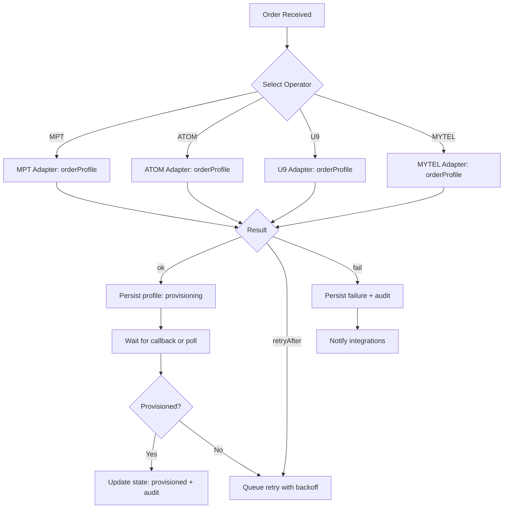
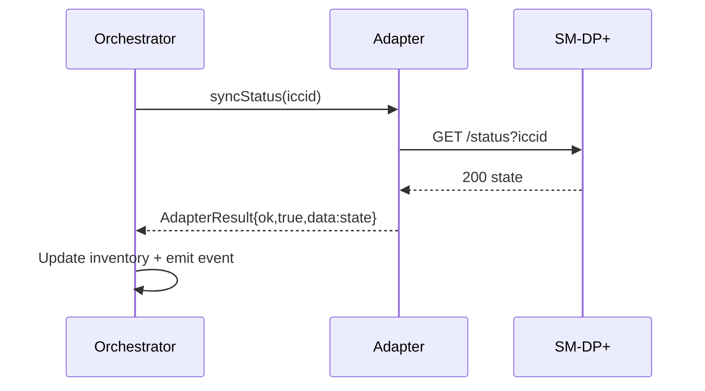

# Provisioning Flowcharts

## Sync Flow

## Offline Fallback
- If device/posture is offline, order is accepted and queued. UI shows pending.
- On reconnect, orchestrator replays queued commands and resumes polling.

## SIM Swap Detection
- Periodic EUICC sync; if EID-ICCID mismatch, emit SwapDetected, lock actions until step-up auth.
